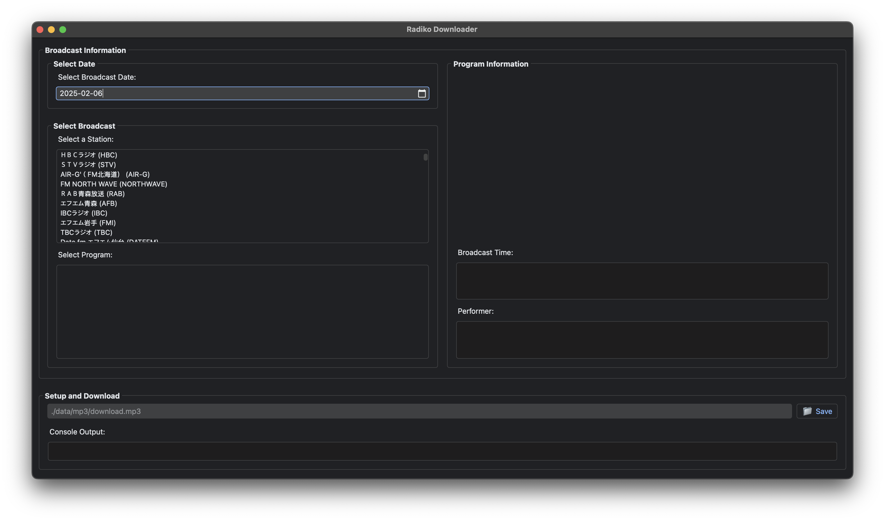
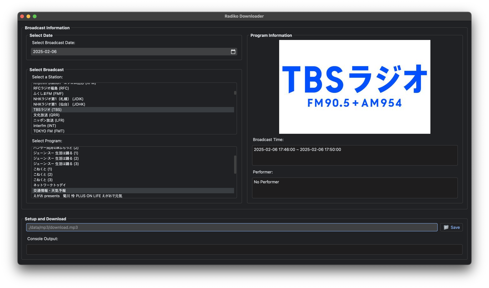

# pyqt5-radiko-downloader

Radiko-Downloader can record the [radiko.jp](https://radiko.jp/) programs outside of Japan.

```console
pyqt5-radiko-downloader
├─ LICENSE.txt
├─ README.md
├─ data
│  ├─ auth
│  │  └─ auth_key.bin
│  ├─ icon
│  │  └─ radiko.ico
│  ├─ image
│  │  ├─ radiko-resize.png
│  │  └─ radiko.png
│  └─ json
│     └─ area.json
├─ main_ui.py
├─ radiko.py
└─ requirements.txt
```

## Theme



## Warning
**Please do not use this project for commercial use. Only for your personal, non-commercial use.**

## Technologies
- `Python` : 3.9

# Technical Details
The authentication of PC(html5) version radkio validates user's location via IP address.
However, the android version of radkio validates user provided by GPS information, not via user's IP address.

# Getting Started
## Installation
- You can install it **locally:**
  ```console
  $ git clone https://github.com/devhaaana/pyqt5-radiko-downloader.git
  $ cd pyqt5-radiko-downloader
  ```

## Usage

```console
python main_ui.py
```


## Reference
[rajiko](https://github.com/jackyzy823/rajiko)
[radiko-downloader](https://github.com/devhaaana/radiko-downloader.git)

